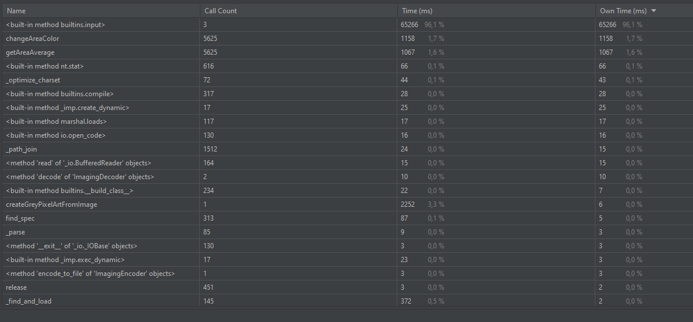
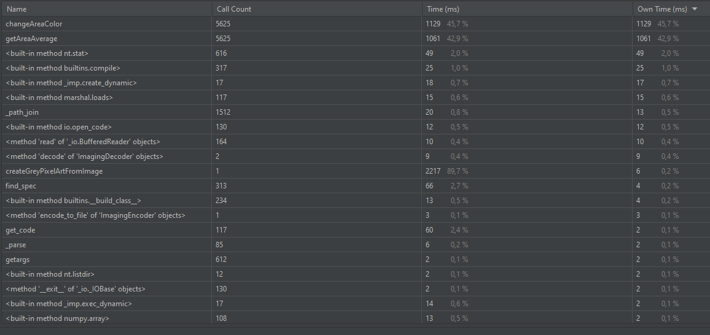
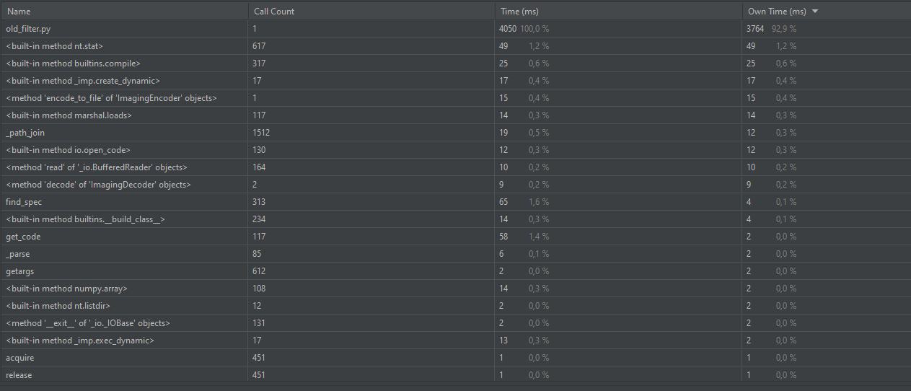
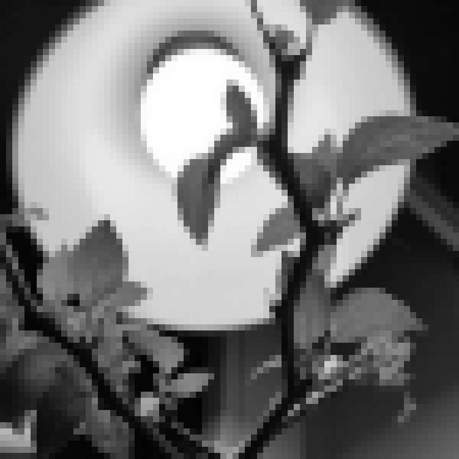

Результаты профайлера с исправленным фильтром.

Результат работы профилировщика с исправленным фильтром, но уже введенными данными.

Результат работы со страой версией.

Оригинал изображения

Результат работы сломаной (первоначальной) функции.

Результат работы исправленного варианта.